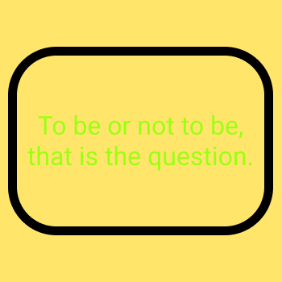

Anyone with an internet connection can access the internet, which is a tremendous resource for all kinds of information. However, accessibility is frequently overlooked or ignored by designers and developers.

Making website content accessible means that all users can access with or without assistive technologies. This includes users who have physical or cognitive impairments as well as color blindness, hearing loss, vision impairments, or both. Some of these people access content on the internet using technologies that boost color contrasts or read the text aloud.

## Why should I care?

<a href="https://www.who.int/en/news-room/fact-sheets/detail/disability-and-health" rel="noopener noreferrer" target="_blank">16% of the world population experience significant disability</a>, and the <a href="https://webaim.org/projects/million/" rel="noopener noreferrer" target="_blank">WebAIM Million report</a> examined the home pages of the top 1 million websites and it was discovered that 96.3% of them failed to adhere to the most basic accessibility guidelines.

You can miss out on a lot of potential visitors if your website is inaccessible! In addition, making your website more accessible increases Search Engine Optimisation and user experience for everyone.

Not making a website accessible because it takes too long and not impacting the majority of users, is the same as saying "_it takes too much time to check grammar, spelling, and proof-read a document_". The process of designing and developing a website _should_ include web accessibility as a natural step alongside considerations for performance, style, and responsiveness for mobile devices.

Web accessibility may be somewhat invisible and seems more like an add-on feature, until the legal systemgets involved. Numerous regulations may call for a website to be accessible, and both <a href="https://www.nad.org/2011/06/16/nad-files-disability-civil-rights-lawsuit-against-netflix/" rel="noopener noreferrer" target="_blank">Netflix</a> and <a href="https://www.cnbc.com/2019/10/07/dominos-supreme-court.html" rel="noopener noreferrer" target="_blank">Dominos</a> have been the target of lawsuits.

## So what can I do?

### Alternative Text

In fact, missing alternative text, also known as _alt text_ for images is <a href="https://webaim.org/projects/million/" rel="noopener noreferrer" target="_blank">one of the biggest accessibility issues</a>.

Alternative text can be a quick and easy way to add accessibility to images.

Alternative text is added on the `` element, and if the image fails to load, the alt text will be shown instead.

<div style="display:flex; flex-wrap: wrap; justify-content: space-evenly;">
<div style="max-width: 40%">

**Image found, alt text not showing:** </br>


</div>
<div style="max-width: 40%">

**Image not found, alt text is showing:** </br>


</div>
</div>

```html

```

Making descriptive alt texts can sometimes be hard when you’re not used to it.

Here are a few tips to writing good alt text:

1. Be specific and concise. Describe the content of the image without editorializing.
2. Never start with "_Image of …_" or "_Picture of …_".
3. Keep it short and descriptive, like a tweet.
4. Leave alt text blank if the image is purely decorative.

### Semantic HTML

HTML already has a lot of descriptive elements that comes with built-in functionality that can save you many lines of Javascript or CSS. So instead of having millions of `<div>` elements, use the elements that suit the context or functionality.

Using HTML to semantically describe an elements position, function, or context, also greatly improves SEO performance, as well as code readability.

This could be as simple as using the <a href="https://developer.mozilla.org/en-US/docs/Web/HTML/Element/header" rel="noopener noreferrer" target="_blank">`<header>`</a> and <a href="https://developer.mozilla.org/en-US/docs/Web/HTML/Element/footer" rel="noopener noreferrer" target="_blank">`<footer>`</a> elements to properly describe where the content is located on the page.

The <a href="https://developer.mozilla.org/en-US/docs/Web/HTML/Element/details" target="_blank" rel="noopener noreferrer">`<details>`</a> element for dropdown accordions:

<div style="margin: 30px 0;">

**Example**

<details>
  <summary>HyperText Markup Language</summary>
  <p>
    HTML is the standard markup language for documents designed to be displayed
    in a web browser.
  </p>
  <p>
    It is often assisted by technologies such as Cascading Style Sheets (CSS)
    and scripting languages such as JavaScript.
  </p>
</details>
</div>

```html
<details>
  <summary>HyperText Markup Language</summary>
  <p>
    HTML is the standard markup language for documents designed to be displayed
    in a web browser.
  </p>
  <p>
    It is often assisted by technologies such as Cascading Style Sheets (CSS)
    and scripting languages such as JavaScript.
  </p>
</details>
```

The <a href="https://developer.mozilla.org/en-US/docs/Web/HTML/Element/output" target="_blank" rel="noopener noreferrer">`<output>`</a> element is a container element into which a site or app can inject the results of a calculation or the outcome of a user action:

<div style="margin: 30px 0;">

**Example**

<form oninput="result.value=parseInt(a.value)+parseInt(b.value)">
  <input type="range" id="b" name="b" value="50" /> +
  <input type="number" id="a" name="a" value="10" /> =<output
    name="result"
    for="a b"
  >
    60
  </output>
</form>

</div>

```html
<form oninput="result.value=parseInt(a.value)+parseInt(b.value)">
  <input type="range" id="b" name="b" value="50" /> +
  <input type="number" id="a" name="a" value="10" /> =<output
    name="result"
    for="a b"
  >
    60
  </output>
</form>
```

or more descriptive elements like <a href="https://developer.mozilla.org/en-US/docs/Web/HTML/Element/address" target="_blank" rel="noopener noreferrer">`<address>`</a> and <a href="https://developer.mozilla.org/en-US/docs/Web/HTML/Element/time" target="_blank" rel="noopener noreferrer">`<time>`</a>.

### Color Contrast

Good color contrast is critical for web accessibility. It helps make content more readable and usable for everyone, including people with low vision or color blindness. By comparing the foreground and background colors e.g. background color and text color, it’s possible to measure the color contrast ratio and test if it lives up to the requirements.

To ensure good color contrast, accessibility guidelines recommend a minimum contrast ratio of 4.5:1 for normal text, although the ratio may vary depending on text size and weight. Tools are available to check color contrast and ensure that it meets the required standards.

<div style="display:flex; flex-wrap: wrap; justify-content: space-evenly; margin:30px 0;">
<div style="max-width: 40%">

**High contrast** - contrast ratio 7.26


</div>

<div style="max-width: 40%">

**Low contrast** - contrast ratio 1.00


</div>
</div>

Most browsers come with a built-in contrast checking tool. In Chrome and Firefox you can find it by opening the developer tools (`Ctrl + Shift + i`), and click the element inspector at the top (`Ctrl + Shift + C`). Now you can hover the cursor anywhere on any website and see the contrast ratio.

If you are trying to pick a color and wish to see the contrast, I like to use <a href="https://colourcontrast.cc/" target="_blank" rel="noopener noreferrer">Colour Contrast Checker</a>.

### Tabbing

_Tabbing_ means being able to select clickable elements like links and buttons on a website by using the Tab-key. Tabbing is crucial for keyboard accessibility on websites, especially for people with disabilities. It enables efficient navigation for keyboard-only users.

This is easy to test yourself, as you can go to any website and press tab through the website yourself. You’ll quickly notice if there are elements that are meant to be clicked, but doesn’t get selected.


You can make any element focusable by adding a **`tabindex=0`** attribute value to it. That will add the element to the list of elements that can be focused. However, if you use HTML semantically, you will rarely have to use this, as `<a>` and `<button>` are already focusable.

```html
<div class="special-button" tabindex="0">This element is focusable</div>
<div class="special-button">This element is not focusable</div>
```

If you have tabbed through a website or two, you quickly find out how tedious it is to tab through <nav> elements with endless navigation links. To combat this, you may add a “skip to content”-link in the very beginning. This element should be hidden unless in focus via tabbing.

An example of a skip element could look like this:

```html
<body>
  <a href="#main" class="skip-to-main-content-link">Skip to main content</a>
  <nav>
    <ul>
      <li>
        <a href="/">Home</a>
      </li>
      <li>
        <a href="/about.html">About</a>
      </li>
      <li>
        <a href="/blog.html">Blog</a>
      </li>
      <li>
        <a href="/contact.html">Contact</a>
      </li>
    </ul>
  </nav>
  <main id="main">
    <h1>Welcome to my website!</h1>

    <!-- Page content goes here! -->
  </main>
</body>
```

```css
.skip-to-main-content-link {
  position: absolute;
  left: -9999px;
  z-index: 999;
  padding: 1em;
  background-color: black;
  color: white;
  opacity: 0;
}
.skip-to-main-content-link:focus {
  left: 50%;
  transform: translateX(-50%);
  opacity: 1;
}
```

## Tools

If you’d like some more tools to improve web accessibility, here are some tools and resources:

- <a href="https://wave.webaim.org/" target="_blank" rel="noopener noreferrer">WAVE</a> can identify many accessibility and Web Content Accessibility Guideline (WCAG) errors, but also facilitates human evaluation of web content.

- <a href="https://www.deque.com/axe/" target="_blank" rel="noopener noreferrer">aXe Devtools</a> is powerful and accurate accessibility toolkit can get you to 80% issue coverage, or more, during development.

- W3’s <a href="https://www.w3.org/WAI/standards-guidelines/wcag/" target="_blank" rel="noopener noreferrer">Web Content Accessibility Guidelines (WCAG)</a> international standard.

- W3’s <a href="https://www.w3.org/WAI/policies/" target="_blank" rel="noopener noreferrer">list of governmental policies</a> related to web accessibility.

- <a href="https://www.nvaccess.org/download/" target="_blank" rel="noopener noreferrer">NVDA</a> software allows blind and vision impaired people to access and interact with the Windows operating system and many third party applications.

## Wrapping Up

While it’s impossible to 100% web accessibility, you can take some basic steps to make your website a little more accessible to the benefit of all your users. Making your website accessible to all users is not only the right thing to do, it's also good for business. Hopefully more businesses will realize this, making web accessibility an increasingly natural part of design, planning, and development for the internet, making a huge difference to a not-so-small minority of users. Until then, you can reaps the rewards of having an accessible website and outmatch your competitor.
