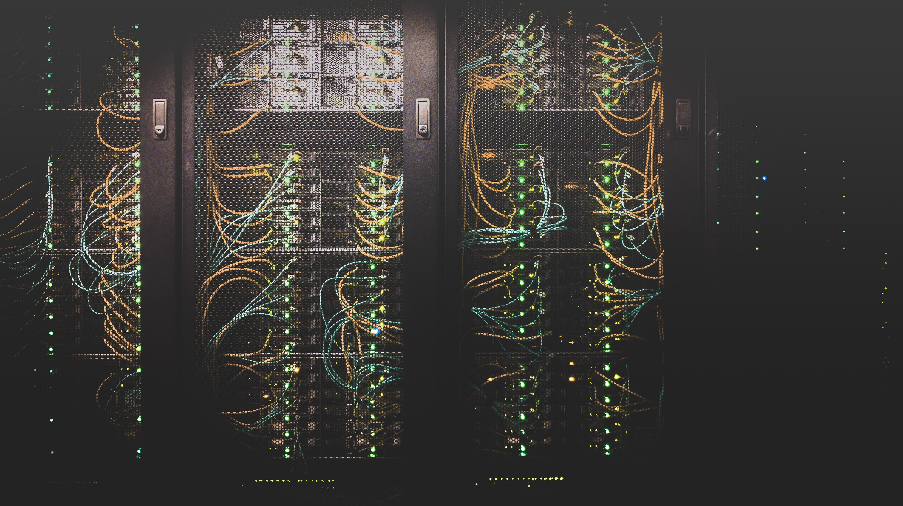

## Introduction

In today's digital world, having a website is no longer a luxury but a necessity for businesses and individuals alike. However, if you're new to the online realm, you may wonder what a website is and what makes it so crucial in today's landscape.

In this article, we'll explore the ins and outs of a website, from its definition to its significance, as well as give a taste of how to make a website from scratch.

## What exactly is a website?

A website is a collection of web pages accessed through a web browser such as Chrome, Safari or Firefox. Simply put, they are files that point to other files, and tell the browser where to find the _Contact_ page file and where the _Product_ page is. When you go to a website, you download these files to your computer or smartphone, after which your web browser can open and interpret the instructions, after which the web browser "builds" the website for you.

Websites are most often made with 3 types of files: HTML, CSS and Javascript.

**HTML** files are the primary file type, and tell the computer what is the heading, paragraph and links to other subpages on the website. HTML also tells the browser where to find the other files for the website, such as the CSS files.

**CSS** is the type of file that tells the browser about the font size, background colors and the distance between the various elements, i.e. CSS makes the website look nice.

**Javascript** is a programming language that websites can use when something needs to change, for example that a red button turns green when you press it.



## Why have a website?

Websites can be used to promote products or services, share information, build a community, or express personal interests and opinions. The internet is now such an integrated part of our lives that it's expected to have an online presence, either on social media, as a business, blogging, or something else entirely.

As a business, a website can act as a business card or go-to for new and old customers to learn about your business. For companies, having a website establishes credibility and accessibility to the customer. When was the last time you Googled a business, didn't find the business, and found that slightly suspicious? Or that you found the website, but it looks like it was made in 1997?
It is simply expected by the customer that you have an online presence as a company.

## Web development

Web development is the process of designing, building, and maintaining user-friendly websites using programming languages, frameworks, and other technologies. There are many ways to make websites, and many underlying information which are not seen by all the website's visitors. For one, these days it is a _must_ that one's website looks just as good on a mobile device as it does on a laptop. A website must be user-friendly for visitors with reduced vision or other disabilities. This is called the 'accessibility' aspect. A website should be designed so that it is easy to navigate and can find important information. Furthermore, it is also the web developer's job to make sure that search engines like Google can find the website.

## Conclusion

Whether you're promoting a business, sharing information, or sharing your personal interests and opinions, a website can help you reach a wider audience, build credibility, and establish a strong online presence. If you have a business, it is even expected from the customer that they can find basic information about your business on the Internet.

## Try it yourself!

See what it's like to be a web developer by making a website yourself!

1. Create a new Text Document `.txt`. Call the file `homepage` or `homepage.txt`.
2. Write the following:

```html
<h1>This is a big headline</h1>

<h2>This is a sub-heading</h2>

<p>This is a paragraph</p>

<button>Click this button!</button>
```

3. Save and close the file.
4. Rename the file extension from `homepage.txt` to `homepage.html`. The file icon should change to your browser's icon.
5. Open the file with the browser.

**Congratulations! You have created your first website!**

If this has piqued your interest in how to make websites, I'd be happy to answer any questions you might have, guide you to where and how to learn more.

### Having trouble?

Make sure you can see the file type when you rename it. If you can't see this, you may need to change your computer's settings.

On `Windows 11`, you can find the setting under `Settings` &rarr; `Privacy & Security` &rarr; `For Developers` &rarr; `File Explorer` &rarr; `Show file extensions`.

Then try renaming the file again.
